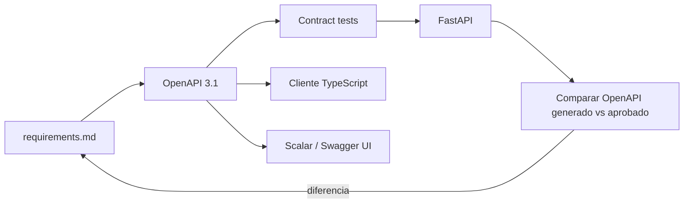

# Estrategia de documentación de API

## Decisión

Usar **OpenAPI 3.1 como contrato fuente**, generado y validado por FastAPI.
Mantener Swagger UI/ReDoc para desarrollo local y publicar una referencia
estática con **Scalar** para el equipo. No exponer una consola interactiva
anónima en producción.

Esto separa tres cosas:

1. **Contrato:** `openapi.json`, versionado y revisado.
2. **Exploración local:** Swagger UI en `/docs` y ReDoc en `/redoc`.
3. **Portal legible:** Scalar renderiza el mismo contrato sin duplicarlo.

Scalar es una alternativa moderna de interfaz; no reemplaza OpenAPI. Si el
equipo no quiere sumar esa dependencia, ReDoc sigue siendo suficiente.

## Convenciones

- OpenAPI `3.1.0`.
- `info.version` con SemVer del contrato.
- Base path `/v1`.
- Tags: `cuenta`, `consentimientos`, `perfiles`, `retos`, `progreso`, `ia`.
- Security scheme OAuth2/OIDC de Cognito y scopes por ruta.
- Ejemplos ficticios; nunca copiar payloads reales.
- Errores con media type `application/problem+json` según RFC 9457.
- `operationId` estable para poder generar un cliente TypeScript.
- Campos JSON en `camelCase`.
- Timestamps RFC 3339 y UTC.
- IDs opacos con formato documentado solo si el cliente debe validarlo.
- Marcar rutas experimentales y deprecadas explícitamente.

## Política de exposición

| Entorno | `/openapi.json` | UI interactiva |
|---|---|---|
| local | habilitado | Swagger UI/ReDoc |
| dev | autenticado o artifact de CI | Scalar interno |
| prod | deshabilitado o protegido | no pública |

No usar el proxy, agente de IA ni funciones de subida del portal de
documentación. Servir assets propios o versiones fijadas si se aprueba Scalar.

## Flujo contract-first



Aunque FastAPI genere el esquema, el cambio se diseña primero en la spec. CI
exporta el OpenAPI, valida sintaxis y falla si existe un diff no revisado.

## Forma de error

```json
{
  "type": "https://ponte-trucha.example/problems/challenge-expired",
  "title": "El reto ya expiró",
  "status": 409,
  "code": "CHALLENGE_EXPIRED",
  "traceId": "01J...",
  "instance": "/v1/retos/ch_123/intentos"
}
```

`detail` solo se incluye cuando no revela datos o reglas internas. Validaciones
de Pydantic se transforman a un catálogo estable de errores; no se devuelve
stack trace.

## Artefactos que Kiro debe crear al implementar

- `backend/openapi/openapi.json` aprobado.
- pruebas de contrato del esquema y ejemplos;
- cliente TypeScript generado o tipos derivados, si el equipo lo aprueba;
- guía de autenticación y errores;
- colección opcional Bruno, no Postman cloud, si se necesita ejecutar ejemplos
  sin subir secretos;
- changelog de API con deprecaciones.

## Referencias

- [FastAPI y OpenAPI automático](https://fastapi.tiangolo.com/features/)
- [FastAPI: URLs de Swagger UI y ReDoc](https://fastapi.tiangolo.com/tutorial/metadata/)
- [Scalar API Reference](https://scalar.com/products/api-references/getting-started)
- [RFC 9457: Problem Details for HTTP APIs](https://datatracker.ietf.org/doc/html/rfc9457)

