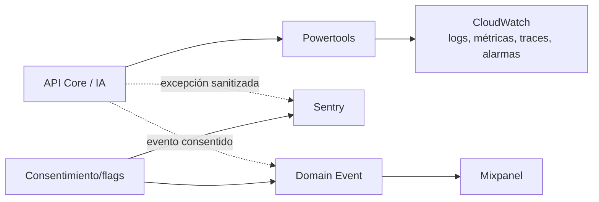

# Observabilidad y privacidad

## Objetivo

Detectar fallos, abuso y degradación; entender el embudo del producto; y hacerlo
sin enviar identidad infantil, texto libre, tokens, IP o payloads a terceros.

## Tres capas

| Capa | Fuente de verdad | Bloquea requests |
|---|---|---|
| Operación | CloudWatch + Powertools | no |
| Errores | Sentry, complementario | no |
| Producto | Mixpanel, opcional | no |

## CloudWatch/Powertools

### Logs permitidos

`timestamp`, `level`, `service`, `environment`, `coldStart`, `requestId`,
`correlationId`, `route`, `method`, `statusCode`, `durationBucket`, `errorCode`.

Prohibido: evento Lambda completo, authorization/cookies, query string, body,
correo, `cognitoSub`, `childId`, texto de retos/chat y prompts/respuestas.

### Métricas mínimas

- `ApiRequestCount`, `ApiErrorCount`, `ApiLatency`;
- `ChallengeIssued`, `AttemptAccepted`, `AttemptDuplicate`;
- `GuardrailRejected`, `CuratedFallbackUsed`;
- `DynamoDbConditionalFailure`, `BedrockError`;
- `AnalyticsDropped`, `SentryDropped`;
- métricas nativas de throttling, duration, concurrent executions y gasto.

Dimensiones: `Environment`, `Service`, `RouteGroup`, `ErrorCode`. No usar IDs ni
`scenarioId` como dimensiones para evitar cardinalidad/costo.

### Alarmas

- 5xx y error rate;
- throttles/concurrency;
- p95 de rutas críticas;
- errores de DynamoDB/Bedrock;
- guardrails/fallback fuera del rango esperado;
- presupuesto y anomalía de costos.

## Sentry

Configuración objetivo:

- `send_default_pii=false`;
- `before_send` elimina request, user, breadcrumbs, contexts sensibles y
  variables locales;
- server-side scrubbing e IP scrubbing;
- DSN en Secrets Manager/SSM o variable protegida;
- traces con sampling bajo y explícito;
- sin Session Replay, user feedback, profiling ni LLM monitoring;
- ambiente/release separados y retención mínima disponible.

Prueba de aceptación: provocar un error con email, token y texto señuelo en
`dev`; confirmar que ninguno aparece en el evento antes de habilitar `prod`.

## Mixpanel

La integración es server-side, opt-in y apagada por defecto. Antes de habilitar:

- consentimiento `productAnalytics` vigente;
- aviso que nombra proveedor/finalidad;
- residencia/retención revisadas;
- `ip=0` para desactivar geolocalización;
- ID analítico aleatorio separado de Cognito y borrable;
- sin User Profiles salvo decisión posterior;
- sin autocapture, Session Replay ni propiedades automáticas del navegador.

### Catálogo inicial

| Evento | Propiedades permitidas |
|---|---|
| `parent_registration_completed` | `authMethod`, `environment` |
| `consent_updated` | `purpose`, `state`, `policyVersion` |
| `child_profile_created` | `ageBand`, `avatarCategory` |
| `challenge_started` | `appType`, `difficulty`, `source` |
| `challenge_answered` | `appType`, `difficulty`, `isCorrect`, `responseTimeBucket` |
| `feedback_viewed` | `appType`, `difficulty` |
| `level_changed` | `appType`, `fromLevel`, `toLevel`, `reasonCode` |
| `guardrail_triggered` | `stage`, `reasonCode`, `fallbackUsed` |
| `backend_degraded` | `dependency`, `errorCode` |
| `account_deleted` | `deletionMode` |

No agregar propiedades sin actualizar esta tabla, threat model y tests.
`consent_updated` operacional puede existir en auditoría propia aun cuando
Mixpanel esté deshabilitado; no se envía al proveedor sin consentimiento.

## Fallos y entrega

Una excepción de telemetría se captura localmente, incrementa un contador y no
se propaga al caso de uso. No usar `BackgroundTasks` de FastAPI para garantías
de entrega en Lambda. Si el volumen o la latencia lo justifican, una tarea
posterior puede introducir EventBridge/SQS + Lambda de analítica con DLQ.

## Retención y borrado

- CloudWatch: retención explícita por ambiente.
- Sentry/Mixpanel: período mínimo que permita el plan; documentar limitaciones.
- Mantener un mapping cifrado y mínimo para borrar el ID analítico; no exportarlo
  a logs.
- Revocar analítica detiene eventos inmediatamente y solicita borrado.
- Borrar cuenta elimina perfiles/progreso e inicia borrado en proveedores.

## Referencias

- [Powertools para Lambda Python](https://docs.aws.amazon.com/powertools/python/latest/)
- [Sentry Python: opciones y `before_send`](https://docs.sentry.io/platforms/python/configuration/options/)
- [Sentry para AWS Lambda Python](https://docs.sentry.io/platforms/python/integrations/aws-lambda/)
- [Mixpanel: opt-out y geolocalización](https://docs.mixpanel.com/docs/privacy/protecting-user-data)
- [Mixpanel: privacidad y residencia](https://docs.mixpanel.com/docs/privacy)

