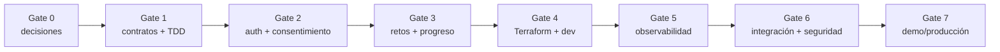

# Plan Kiro — backend serverless

El nombre del archivo se conserva por compatibilidad, pero el plan usa **gates**
y no promete que cada fase dure exactamente un día. No escribir código fuera de
una tarea aprobada.

## Regla de ejecución

```text
requirements → design/ADR → test rojo → implementación mínima
             → refactor → verificación → marcar [x]
```

## Ruta crítica



## Gate 0 — Decisiones

Owner: Francis.

- Resolver ADR de Web Adapter, sesión Cognito, diseño DynamoDB, analítica
  asincrónica y modelo/región Bedrock.
- Validar consentimiento verificable con asesoría legal.
- Aprobar OpenAPI inicial, access patterns y threat model.
- Confirmar límites de presupuesto y cuenta AWS.

Salida: ADR, OpenAPI draft y specs sin contradicciones.

## Gate 1 — Setup y contratos

Owner: Francis.

- Crear backend Python/toolchain solo desde tareas.
- Configurar pytest, lint, tipos y tests de arquitectura.
- Crear Terraform base y tests con mocks.
- Crear CI sin credenciales persistentes.

Salida: test rojo verificable, `terraform validate/test` disponibles y ningún
recurso aplicado.

## Gate 2 — Adulto, consentimiento y perfiles

Owners: Francis; Jerick para UI; Clau/PM para textos.

- Cognito adulto + JWT scopes.
- Modelo versionado de consentimiento.
- Perfiles sin PII infantil.
- IDOR, revocación y borrado.
- Onboarding adulto inspirado en el patrón de YouTube Kids, sin copiar marca ni
  confundir age gate con verificación.

Salida: dos cuentas aisladas, consentimientos opcionales apagados y borrado
probado en `dev`.

## Gate 3 — Retos, apps y progreso

Owners: Francis; Clau aprueba reglas; Jerick integra UI.

- Factory/Strategy para Roblox, SMS, email y WhatsApp.
- Repository + DynamoDB.
- Emisión sin respuesta correcta.
- Intento idempotente y progreso autoritativo.
- Adaptación determinista.
- IA con guardrails y fallback curado.

Salida: contract tests por app, retry sin score doble y guardrail inseguro en
fallback.

## Gate 4 — Infraestructura dev

Owner: Francis.

- Terraform para S3/CloudFront, Cognito, API Gateway, Lambda, DynamoDB, IAM,
  secretos y límites.
- `fmt`, `validate`, `test`, plan revisado.
- Apply únicamente a `dev`.
- Smoke/integration tests y teardown documentado.

Salida: URL `dev`, estado Terraform controlado, recursos etiquetados.

## Gate 5 — Observabilidad

Owner: Francis; Clau valida interpretación de producto.

- Powertools/CloudWatch y dashboards.
- Alarmas + presupuesto + runbooks.
- Sentry scrubbed con prueba señuelo.
- Mixpanel opt-in server-side con allowlist; permanece apagado hasta aprobar
  privacidad/residencia.
- Pruebas de caída de proveedores.

Salida: diagnóstico sin PII y juego funcional con proveedores caídos.

## Gate 6 — Integración y revisión

Owners: todo el equipo.

- Cliente TypeScript/contratos OpenAPI.
- UI con loading/error/retry accesible.
- Test E2E del flujo adulto → perfil → reto → progreso.
- Revisión de contenido, seguridad, accesibilidad y costo.
- Exportación/borrado.

Salida: checklist de PRD completo, cero tareas críticas pendientes.

## Gate 7 — Demo y producción

- Decisión explícita `go/no-go`.
- Deploy reproducible desde Terraform/CI.
- Scalar/OpenAPI accesible al equipo, no consola pública.
- Video/diagrama/README sincronizados con lo realmente implementado.
- Rollback y kill switches de IA/Mixpanel/Sentry.

## Paralelización segura

| Track | Owner | Puede avanzar cuando |
|---|---|---|
| API/dominio | Francis | Gate 0 aprobado |
| IaC | Francis | access patterns y contrato definidos |
| Onboarding/UI | Jerick | OpenAPI auth/perfiles estable |
| Contenido/schemas | Clau | contrato por app aprobado |
| Privacidad/copy | Clau + revisión legal | finalidades definidas |

## Definición de terminado

- Tarea `[x]` en la spec correcta.
- Test escrito antes y pasando.
- Verificación ejecutada, no asumida.
- Documentación/diagrama actualizado si cambió contrato o infraestructura.
- Sin PII/secrets en diff, logs ni artifacts.
- Siguiente owner informado.
