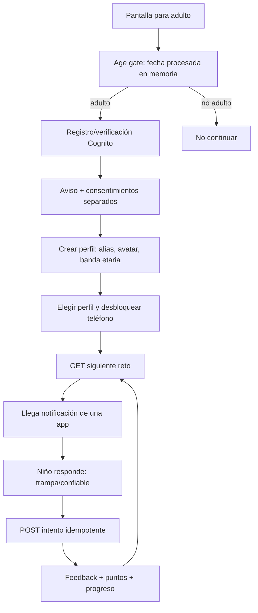

# PRD / Brief — Backend serverless de Ponte Trucha Kids

**Owner:** Francis  
**Estado:** arquitectura y alcance definidos; implementación pendiente  
**Fecha de corte:** 23 de julio de 2026

## 1. Resumen

Ponte Trucha Kids es un simulador de phishing y peligro digital para niños de 8
a 13 años. El adulto crea la cuenta, otorga los consentimientos aplicables y
crea uno o más perfiles infantiles. El niño practica en un teléfono simulado
con retos de Roblox, SMS, email y WhatsApp; identifica si el contenido es una
trampa o es confiable, recibe feedback y progresa en dificultad.

El backend debe autenticar al adulto, proteger los perfiles, entregar retos
seguros, calcular intentos de forma autoritativa y adaptar el siguiente reto sin
recolectar datos innecesarios del niño.

## 2. Problema

El frontend actual permite demostrar el loop, pero no resuelve:

- registro e inicio de sesión del adulto;
- consentimiento versionado y revocable;
- perfiles y progreso persistentes entre dispositivos;
- entrega autoritativa de retos sin revelar la respuesta;
- dificultad adaptativa basada en desempeño;
- generación asistida por IA con revisión y fallback seguro;
- diagnóstico operativo y métricas de producto con privacidad.

## 3. Objetivos

1. Completar el flujo adulto → consentimiento → perfil infantil → juego.
2. Persistir progreso sin crear cuentas ni recolectar PII del niño.
3. Entregar y calificar retos mediante una API segura e idempotente.
4. Soportar Roblox, SMS, email y WhatsApp con un contrato extensible.
5. Adaptar dificultad de manera explicable y testeable.
6. Mantener el MVP sin servidores administrados y con límites de costo.
7. Hacer observables errores, latencia, seguridad y embudo sin registrar texto
   libre ni identidad infantil.

## 4. No objetivos del MVP

- Red social, chat entre usuarios, leaderboard público o amigos.
- Compra, suscripción, anuncios o monetización.
- Login del niño, SSO escolar o cuentas docentes.
- Voz, fotos, archivos, geolocalización o contactos.
- Generación autónoma de contenido publicado sin guardrails/revisión.
- EC2, RDS, WebSockets, microservicios, data lake o recomendaciones con ML
  entrenado sobre datos personales.
- Afirmar cumplimiento legal sin revisión profesional.

## 5. Personas

### Padre, madre o tutor

Quiere registrar una cuenta, entender qué datos se usan, autorizar o rechazar
finalidades opcionales, crear perfiles, ver progreso agregado y borrar datos.

### Niño de 8 a 13

Quiere entrar a su perfil mediante un avatar/alias, resolver retos y recibir
feedback sin formularios legales, publicidad ni solicitudes de datos reales.

### Equipo

Necesita depurar fallos, medir la experiencia y agregar canales sin debilitar
privacidad, guardrails ni costo.

## 6. Principios de producto

- **Cuenta adulta, perfil infantil:** Cognito nunca representa al niño.
- **Necesario separado de opcional:** IA server-side y Mixpanel tienen
  consentimiento/flags separados.
- **Minimización:** guardar banda etaria y resultados, no fechas ni texto libre.
- **Servidor autoritativo:** progreso, score y respuesta correcta se deciden en
  backend.
- **Falla segura:** ante error de IA se usa un escenario curado; ante error de
  analítica el juego continúa.
- **Adaptación explicable:** reglas deterministas antes que un modelo opaco.
- **TDD y contratos:** cada comportamiento nace de una prueba y OpenAPI.

## 7. Experiencia principal

La fecha del adulto no se persiste. Antes de producción debe definirse un método
de consentimiento verificable apropiado para la jurisdicción.

## 8. Alcance funcional

### 8.1 Cuenta y sesión adulta

- Registro con email, verificación e inicio/cierre de sesión.
- Recuperación de cuenta.
- Access token de Cognito validado por API Gateway.
- Área adulta protegida para consentimientos, perfiles y borrado.

### 8.2 Consentimiento

- Finalidades: `core`, `serverSideAi`, `productAnalytics`.
- `core` es necesario para persistencia; los otros son opcionales.
- Guardar versión, estado, timestamps, método y actor adulto.
- Reconsentir cuando cambie materialmente la versión.
- Revocar sin castigo y ejecutar efectos posteriores.

### 8.3 Perfiles infantiles

- Alias y avatar seleccionados de catálogo.
- Banda etaria `8-10` o `11-13`.
- Máximo configurable de perfiles por adulto.
- Ver, editar opciones no identificatorias y borrar.
- Ownership obligatorio en todos los accesos.

### 8.4 Retos y apps

Un reto tiene base común y payload discriminado por `appType`.

| App | Campos específicos mínimos |
|---|---|
| `email` | remitente visible, asunto, cuerpo, enlaces mostrados |
| `sms` | remitente/teléfono enmascarado, cuerpo, enlaces mostrados |
| `whatsapp` | nombre visible, verificación simulada, burbujas, adjunto ficticio |
| `roblox` | usuario visible, contexto de juego, burbujas, oferta/intercambio |

La Factory selecciona constructor, validador y política por canal. Las
estrategias de dificultad y selección permanecen independientes.

### 8.5 Intentos, score y progreso

- Cada `challengeId` solo admite un intento calificable.
- `Idempotency-Key` devuelve el mismo resultado en reintentos.
- El backend calcula correcto/incorrecto, señales, puntos y nivel.
- Progreso por app y agregado.
- No leaderboard público en MVP.

### 8.6 Adaptación

La primera versión usa reglas:

- subir dificultad tras dominio sostenido, no por un único acierto;
- bajar o estabilizar tras errores repetidos;
- evitar repetir escenario en una ventana configurable;
- mezclar trampas y mensajes confiables;
- respetar banda etaria y canales habilitados;
- registrar razón de selección como código, no como texto personal.

La IA puede proponer contenido o variantes, pero no decide el perfil psicológico
del niño.

### 8.7 IA

- Plan A: ejecución on-device cuando esté disponible.
- Plan B: Lambda aislada + Bedrock con retención cero.
- Entrada desidentificada y limitada.
- Pipeline: schema → alcance → contenido infantil → seguridad → duplicado →
  publicación/fallback.
- Banco curado siempre disponible.

### 8.8 Observabilidad

- CloudWatch/Powertools: logs JSON, métricas EMF, traces y alarmas.
- Sentry: errores sanitizados, sin PII, cuerpos, replay ni LLM monitoring.
- Mixpanel: eventos server-side de lista permitida, solo con consentimiento,
  sin geolocalización.
- Correlation ID técnico atraviesa API y logs; no representa a una persona.

## 9. API propuesta

| Método | Ruta | Propósito |
|---|---|---|
| GET | `/v1/me` | configuración mínima de la cuenta adulta |
| GET/PUT | `/v1/consentimientos` | leer o registrar decisiones versionadas |
| GET/POST | `/v1/perfiles` | listar o crear perfiles propios |
| GET/PATCH/DELETE | `/v1/perfiles/{childId}` | administrar un perfil propio |
| GET | `/v1/perfiles/{childId}/progreso` | progreso agregado y por app |
| GET | `/v1/perfiles/{childId}/retos/siguiente` | emitir reto seguro |
| POST | `/v1/retos/{challengeId}/intentos` | responder y calificar una vez |
| POST | `/v1/conversaciones/respuestas` | fallback IA efímero y consentido |
| DELETE | `/v1/me` | borrar cuenta, perfiles y datos vinculados |
| GET | `/health` | salud técnica sin detalles sensibles |

El contrato detallado se define primero en OpenAPI 3.1. Todos los errores siguen
RFC 9457.

## 10. Arquitectura

Ver el [diagrama de arquitectura](../../docs/diagramas/arquitectura-backend.svg)
y `.kiro/steering/arquitectura.md`.

Decisiones:

- S3 privado + CloudFront;
- Cognito User Pool para adultos;
- API Gateway HTTP API con JWT authorizer y scopes;
- Lambda Python 3.14 + FastAPI + AWS Lambda Web Adapter;
- DynamoDB;
- Bedrock opcional;
- CloudWatch, X-Ray/Powertools, Sentry y Mixpanel;
- Terraform.

### Por qué DynamoDB y no RDS

Los access patterns son de clave/ownership, no joins o reporting relacional.
DynamoDB evita instancias, conexiones y VPC, escala a cero operacionalmente y
encaja con Lambda. RDS solo se reconsidera si aparecen consultas relacionales
esenciales demostradas.

### Por qué no EC2

No existe proceso persistente, dependencia de sistema ni carga sostenida que lo
justifique. Añadir EC2 aumenta parches, superficie de ataque y costo.

## 11. Calidad y atributos no funcionales

| Atributo | Objetivo MVP |
|---|---|
| Disponibilidad | degradar IA/analítica sin impedir retos curados |
| Latencia | p95 API Core < 800 ms sin cold start; medir antes de prometer |
| Seguridad | ownership, mínimo privilegio, cifrado y pruebas IDOR |
| Privacidad | cero PII infantil; cero texto libre persistido |
| Cobertura | 90 % dominio/guardrails; 80 % backend total |
| Accesibilidad | frontend WCAG 2.2 AA |
| Costo | presupuesto/alarma y límites; objetivo, no garantía, dentro de créditos/free tier |
| Portabilidad | dominio independiente de AWS; adapters intercambiables |
| Documentación | OpenAPI 3.1 versionado y Scalar estático en entorno interno |

## 12. Estrategia TDD

Orden de construcción:

1. Domain tests: consentimiento, transición de retos, score y adaptación.
2. Use-case tests con repositories/analytics/IA falsos.
3. Contract tests de factories, guardrails y OpenAPI.
4. Integration tests de DynamoDB e HTTP.
5. Terraform tests con mocks y planes.
6. E2E mínimo en `dev`.

Cada tarea de Kiro debe expresar primero el test rojo, luego implementación y
finalmente refactor/verificación.

## 13. Métricas de éxito

Producto, solo con consentimiento analítico:

- activación: adulto verificado → consentimiento core → primer perfil;
- `challengeCompletionRate`;
- exactitud por app/dificultad en agregados;
- porcentaje de feedback completado;
- progresión de nivel sin frustración repetida;
- tasa de fallback IA y guardrails.

Operación:

- errores 5xx, 4xx anómalos y throttles;
- p50/p95/p99 por ruta;
- cold starts y duración;
- fallos/latencia de DynamoDB y Bedrock;
- gasto estimado y utilización de límites;
- eventos descartados por sanitización.

Ninguna métrica justifica recolectar texto del niño.

## 14. Riesgos y mitigaciones

| Riesgo | Mitigación |
|---|---|
| Age gate confundido con consentimiento verificable | Mensaje explícito, revisión legal y tarea separada |
| IA produce contenido inseguro | pipeline de guardrails + banco curado + kill switch |
| IDOR entre perfiles | ownership server-side y pruebas con dos cuentas |
| Doble puntuación | idempotencia + transacción condicional |
| Mixpanel/Sentry recolectan de más | server-side, allowlist, scrubbers, flags apagados |
| Free tier cambiante | presupuesto, alarmas, reserved concurrency y revisión mensual |
| Sobrearquitectura | monolito modular, sin EC2/RDS/VPC/microservicios |
| Contrato frontend/backend diverge | OpenAPI source of truth + contract tests |

## 15. Gate de lanzamiento

- [ ] Revisión de consentimiento y aviso de privacidad.
- [ ] Threat model y pruebas IDOR.
- [ ] Borrado/exportación probados.
- [ ] OpenAPI y documentación sincronizados.
- [ ] Alarmas y presupuesto probados.
- [ ] Mixpanel apagado sin consentimiento.
- [ ] Sentry verificado con payload señuelo y sin PII.
- [ ] Bedrock con retención cero o fallback desactivado.
- [ ] Runbook de incidentes y rollback.
- [ ] Prueba con contenido/tono infantil aprobada por Clau.

## 16. Referencias de decisión

- [Reglamento peruano de protección de datos personales — DS 016-2024-JUS](https://diariooficial.elperuano.pe/Normas/obtenerDocumento?idNorma=23)
- [FTC: consentimiento parental verificable](https://www.ftc.gov/business-guidance/privacy-security/verifiable-parental-consent-childrens-online-privacy-rule)
- [Cognito: atributos de User Pools](https://docs.aws.amazon.com/cognito/latest/developerguide/user-pool-settings-attributes.html)
- [API Gateway: JWT authorizers](https://docs.aws.amazon.com/apigateway/latest/developerguide/http-api-jwt-authorizer.html)
- [Lambda Python](https://docs.aws.amazon.com/lambda/latest/dg/lambda-python.html)
- [Powertools for AWS Lambda](https://docs.aws.amazon.com/powertools/python/latest/)
- [Bedrock: retención de datos](https://docs.aws.amazon.com/bedrock/latest/userguide/data-retention.html)
- [Guardrails de costo y free tier](costos-aws.md)
