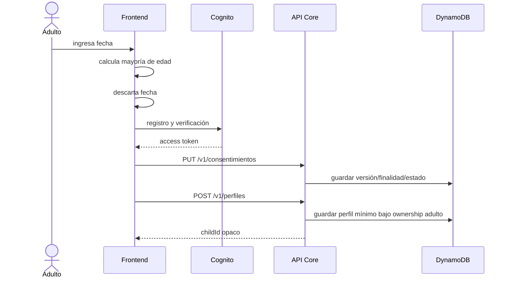
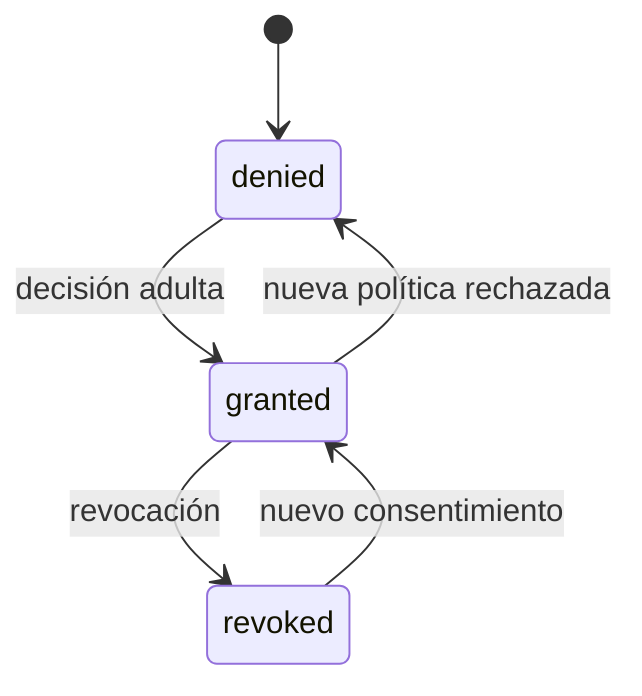

# Diseño — Autenticación y consentimiento parental

## Estado

Diseño objetivo; no implementado.

## Flujo



El backend no acepta una fecha de nacimiento. El frontend envía únicamente un
proof efímero/estado de gate definido en la tarea de seguridad. Para el MVP de
hackathon, ese proof no debe presentarse como consentimiento parental
verificable; el mecanismo final requiere revisión legal.

## Cognito

- User Pool exclusivo para adultos.
- Email verificable como atributo de acceso.
- No hacer `birthdate` requerido; el esquema de atributos es difícil de cambiar
  y no necesitamos persistirlo.
- App client público sin client secret para SPA.
- Authorization Code + PKCE si se usa Hosted UI; si se usa UI custom, abrir ADR
  sobre almacenamiento de tokens y CSRF.
- Access tokens con scopes:
  - `profiles:read`, `profiles:write`;
  - `consent:read`, `consent:write`;
  - `game:play`;
  - `account:delete`.
- API Gateway valida issuer, audience, expiración y scopes.

## Modelo

```text
ConsentRecord
  parentSubHash
  purpose: core | serverSideAi | productAnalytics
  state: granted | denied | revoked
  policyVersion
  method
  decidedAt
  revokedAt?

ChildProfile
  childId
  ownerParentSub
  aliasId
  avatarId
  ageBand: 8-10 | 11-13
  createdAt
  updatedAt
  status: active | deleting
```

`ownerParentSub` permanece en AWS y no sale a proveedores. Si se requiere una
vista analítica, se crea un ID aleatorio separado.

## Casos de uso

- `GetMyAccount`
- `GetConsents`
- `UpdateConsent`
- `CreateChildProfile`
- `ListChildProfiles`
- `UpdateChildProfile`
- `DeleteChildProfile`
- `DeleteAdultAccount`

Cada caso de uso recibe `AuthenticatedAdult` desde el entrypoint, no desde el
body.

## Transiciones



Un cambio de versión invalida el permiso para esa finalidad hasta obtener una
decisión vigente.

## Errores

- `CONSENT_REQUIRED` → 403.
- `PROFILE_NOT_FOUND` → 404 tanto para ausente como ajeno.
- `PROFILE_LIMIT_REACHED` → 409.
- `POLICY_VERSION_STALE` → 409.
- `IDEMPOTENCY_CONFLICT` → 409.

Formato RFC 9457.

## Decisiones pendientes

1. Hosted UI + PKCE versus UI custom de Cognito.
2. Método de consentimiento parental verificable para producción.
3. Máximo de perfiles y retención de progreso.
4. Flujo de exportación y SLA de borrado.

