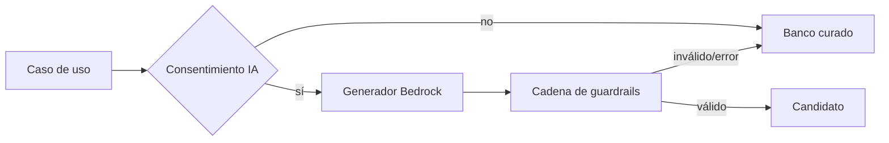

# Diseño — Backend serverless

## Decisiones

| Tema | Decisión |
|---|---|
| Persistencia | DynamoDB; no RDS |
| Cómputo | Lambda; no EC2 |
| Framework | Python 3.14 + FastAPI + AWS Lambda Web Adapter |
| API | API Gateway HTTP API + JWT authorizer |
| Arquitectura interna | Hexagonal / ports and adapters |
| Infra | Terraform |
| Documentación | OpenAPI 3.1 + Scalar interno |
| Errores | RFC 9457 |
| Pruebas | pytest + contract/integration + terraform test |

## Despliegues lógicos

- `api-core`: endpoints de cuenta, consentimiento, perfiles, retos e intentos.
- `api-ia`: endpoint efímero y generación controlada.
- No añadir una Lambda por endpoint. Separar solo límites de IAM, timeout y costo.

## Dominio

Agregados:

- `Consent`
- `ChildProfile`
- `Challenge`
- `Attempt`
- `Progress`

Value objects:

- `AppType`, `AgeBand`, `Difficulty`, `ChallengeStatus`, `ConsentPurpose`,
  `ConsentState`, `IdempotencyKey`.

## Puertos

```python
# Pseudocontrato, no implementación.
class ChallengeRepository(Protocol): ...
class ProgressRepository(Protocol): ...
class ConsentRepository(Protocol): ...
class ScenarioSource(Protocol): ...
class AiScenarioGenerator(Protocol): ...
class AnalyticsPort(Protocol): ...
class Clock(Protocol): ...
class IdGenerator(Protocol): ...
```

## Patrones por feature

### Apps y escenarios — Abstract Factory

`ScenarioFactoryRegistry` resuelve una factory por `AppType`. Cada factory crea
el payload específico y declara su validator. El registro falla al inicio si un
canal no tiene factory.

No colocar rendering frontend en esta factory; solo contrato y reglas de
backend.

### Selección/adaptación — Strategy + Specification

- `EligibilitySpecification`: banda, canal habilitado, no repetición,
  consentimiento y estado de publicación.
- `DifficultyStrategy`: calcula nivel siguiente usando una ventana de resultados.
- `ScenarioSelectionStrategy`: mezcla confiable/trampa y evita monotonía.

Las estrategias devuelven `reasonCode` testeable.

### Guardrails — Chain of Responsibility

Orden:

1. parse/schema;
2. longitud y campos permitidos;
3. alcance phishing/fraude;
4. PII/solicitud de secretos;
5. temas prohibidos;
6. tono y banda etaria;
7. enlaces/adjuntos simulados;
8. duplicados;
9. resultado o fallback.

### Persistencia — Repository

El repository traduce entidades a items DynamoDB. Condiciones y transacciones
protegen ownership, estado e idempotencia.

### Analítica — Domain Events

Casos de uso emiten eventos de dominio sin SDK externo. Un adapter filtra por
consentimiento y catálogo. Fallar al enviar no revierte la operación.

## Access patterns DynamoDB

| Operación | Patrón |
|---|---|
| listar perfiles de adulto | Query por PK adulta |
| leer/editar perfil propio | Get/Update condicional por PK+SK |
| obtener progreso | Query por PK infantil |
| emitir reto | Put condicional de challenge + TTL |
| responder reto | TransactWrite: estado + intento + progreso + idempotencia |
| borrar cuenta/perfil | Query por particiones conocidas + workflow idempotente |

No fijar el diseño físico definitivo hasta probar estos patrones. Preferir una
tabla de dominio y una tabla de idempotencia si simplifica IAM/TTL; la meta no
es “single table” por sí misma.

## API

Contrato de rutas en el PRD. Reglas:

- access token y scopes;
- `Idempotency-Key` para mutaciones sensibles;
- `Cache-Control: no-store` en datos de cuenta/perfil;
- CORS allowlist;
- límites de body;
- correlation ID;
- problem details.

## IA



Bedrock usa retención cero. No almacenar input/output ni habilitar observabilidad
que capture prompts.

## Pruebas

- Unit: entidades, strategies, specifications, factories y guardrails.
- Contract: cada adapter cumple su Protocol y cada app su schema.
- HTTP: auth, scopes, RFC 9457, idempotencia y OpenAPI snapshot.
- Integration: DynamoDB y transacciones.
- IaC: mocks/plan por defecto; apply solo con aprobación en cuenta sandbox.
- Security: IDOR, mass assignment, injection, secret/PII logging y rate limits.

## ADR pendientes

- ADR-001: registrar la elección por defecto de Web Adapter frente a Mangum y
  decidir empaquetado ZIP o imagen; un spike solo la cambia con evidencia.
- ADR-002: sesión Cognito en SPA.
- ADR-003: diseño físico DynamoDB.
- ADR-004: integración asincrónica de Mixpanel.
- ADR-005: modelo/región Bedrock con retención cero.
