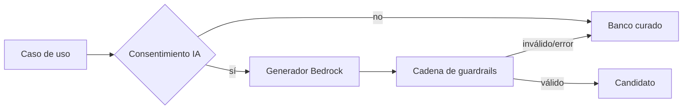

# Diseño — Backend serverless

## Decisiones

| Tema | Decisión |
|---|---|
| Persistencia | DynamoDB; no RDS |
| Cómputo | Lambda; no EC2 |
| Framework | Python 3.14 + FastAPI + AWS Lambda Web Adapter |
| API | API Gateway HTTP API + JWT authorizer |
| Arquitectura interna | Hexagonal / ports and adapters |
| Infra | Terraform |
| Documentación | OpenAPI 3.1 + Scalar interno |
| Errores | RFC 9457 |
| Pruebas | pytest + contract/integration + terraform test |

## Despliegues lógicos

- `api-core`: endpoints de cuenta, consentimiento, perfiles, retos e intentos.
- `api-ia`: endpoint efímero y generación controlada.
- No añadir una Lambda por endpoint. Separar solo límites de IAM, timeout y costo.

## Dominio

Agregados:

- `Consent`
- `ChildProfile`
- `Challenge`
- `Attempt`
- `Progress`

Value objects:

- `AppType`, `AgeBand`, `Difficulty`, `ChallengeStatus`, `ConsentPurpose`,
  `ConsentState`, `IdempotencyKey`.

## Puertos

```python
# Pseudocontrato, no implementación.
class ChallengeRepository(Protocol): ...
class ProgressRepository(Protocol): ...
class ConsentRepository(Protocol): ...
class ScenarioSource(Protocol): ...
class AiScenarioGenerator(Protocol): ...
class AnalyticsPort(Protocol): ...
class Clock(Protocol): ...
class IdGenerator(Protocol): ...
```

## Patrones por feature

### Apps y escenarios — Abstract Factory

`ScenarioFactoryRegistry` resuelve una factory por `AppType`. Cada factory crea
el payload específico y declara su validator. El registro falla al inicio si un
canal no tiene factory.

No colocar rendering frontend en esta factory; solo contrato y reglas de
backend.

El mismo registro expone `list_channels()`, una lectura de solo metadata (sin
instanciar retos) usada por el catálogo público. Añadir un canal implica
registrar su factory una sola vez; el catálogo se deriva de ahí, nunca se
mantiene por separado.

### Selección/adaptación — Strategy + Specification

- `EligibilitySpecification`: banda, canal habilitado, no repetición,
  consentimiento y estado de publicación.
- `DifficultyStrategy`: calcula nivel siguiente usando una ventana de resultados.
- `ScenarioSelectionStrategy`: mezcla confiable/trampa y evita monotonía.

Las estrategias devuelven `reasonCode` testeable.

### Guardrails — Chain of Responsibility

Orden:

1. parse/schema;
2. longitud y campos permitidos;
3. alcance phishing/fraude;
4. PII/solicitud de secretos;
5. temas prohibidos;
6. tono y banda etaria;
7. enlaces/adjuntos simulados;
8. duplicados;
9. resultado o fallback.

### Persistencia — Repository

El repository traduce entidades a items DynamoDB. Condiciones y transacciones
protegen ownership, estado e idempotencia.

### Analítica — Domain Events

Casos de uso emiten eventos de dominio sin SDK externo. Un adapter filtra por
consentimiento y catálogo. Fallar al enviar no revierte la operación.

## Access patterns DynamoDB

| Operación | Patrón |
|---|---|
| listar perfiles de adulto | Query por PK adulta |
| leer/editar perfil propio | Get/Update condicional por PK+SK |
| obtener progreso | Query por PK infantil |
| emitir reto | Put condicional de challenge + TTL |
| responder reto | TransactWrite: estado + intento + progreso + idempotencia |
| borrar cuenta/perfil | Query por particiones conocidas + workflow idempotente |

ADR-003 adopta una tabla de dominio y otra de idempotencia, sin GSI inicial. El
detalle de claves, items, transacciones, TTL, borrado y capacidad está en
[`adr/ADR-003-modelo-fisico-dynamodb.md`](adr/ADR-003-modelo-fisico-dynamodb.md).
La implementación debe validar los patrones con contract e integration tests
antes de considerar estable cualquier parámetro diferido.

## API

Contrato de rutas en el PRD. Reglas:

- access token y scopes;
- `Idempotency-Key` para mutaciones sensibles;
- `Cache-Control: no-store` en datos de cuenta/perfil;
- CORS allowlist;
- límites de body;
- correlation ID;
- problem details.

### Catálogo de apps — `GET /v1/apps`

- Público, sin access token, igual que `/health`. No expone datos de cuenta,
  perfil, progreso ni escenario; solo metadata de canal.
- Responde `appType`, nombre visible y clave de ícono para cada canal habilitado
  del `ScenarioFactoryRegistry`, en el orden de prioridad de producto.
- `Cache-Control` corto (minutos) porque el catálogo cambia solo al desplegar
  un canal nuevo, no por usuario ni por tiempo real.
- El frontend lo consulta una vez al iniciar sesión de juego para pintar los
  íconos disponibles; no reemplaza `GET /v1/perfiles/{childId}/retos/siguiente`,
  que sigue siendo el único origen del contenido de un reto.

## IA


```mermaid
flowchart LR
    UC["Caso de uso"] --> C{"Consentimiento IA"}
    C -->|no| B["Banco curado"]
    C -->|sí| G["Generador Bedrock"]
    G --> V["Cadena de guardrails"]
    V -->|válido| R["Candidato"]
    V -->|inválido/error| B
```

Bedrock usa retención cero. No almacenar input/output ni habilitar observabilidad
que capture prompts.

## Pruebas

- Unit: entidades, strategies, specifications, factories y guardrails.
- Contract: cada adapter cumple su Protocol y cada app su schema.
- HTTP: auth, scopes, RFC 9457, idempotencia y OpenAPI snapshot.
- Integration: DynamoDB y transacciones.
- IaC: mocks/plan por defecto; apply solo con aprobación en cuenta sandbox.
- Security: IDOR, mass assignment, injection, secret/PII logging y rate limits.

## ADR aceptados

- [ADR-001: Lambda Web Adapter y empaquetado](adr/ADR-001-lambda-web-adapter-y-empaquetado.md).
- [ADR-002: sesión Cognito para la SPA](adr/ADR-002-sesion-cognito-spa.md).
- [ADR-003: modelo físico DynamoDB](adr/ADR-003-modelo-fisico-dynamodb.md).
- [ADR-004: analítica desacoplada](adr/ADR-004-analitica-desacoplada.md).
- [ADR-005: Bedrock deshabilitado hasta verificar retención cero](adr/ADR-005-bedrock-deshabilitado-hasta-retencion-cero.md).
- [ADR-006: Nova Lite con retención cero y activación diferida](adr/ADR-006-bedrock-nova-lite-con-retencion-cero.md).
