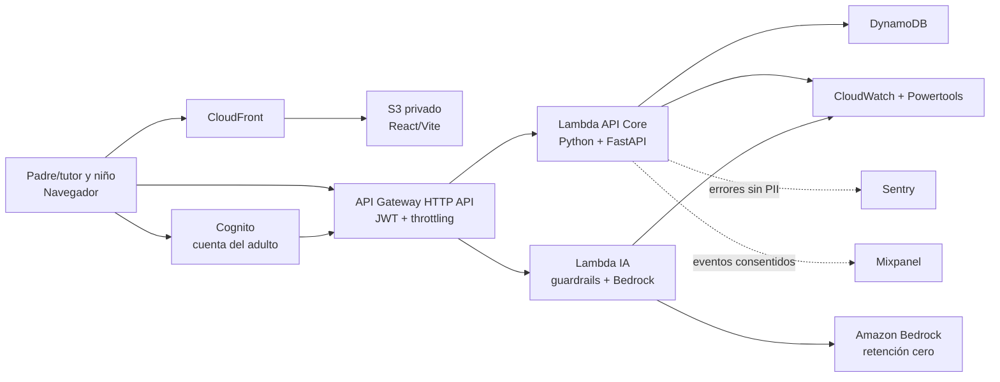
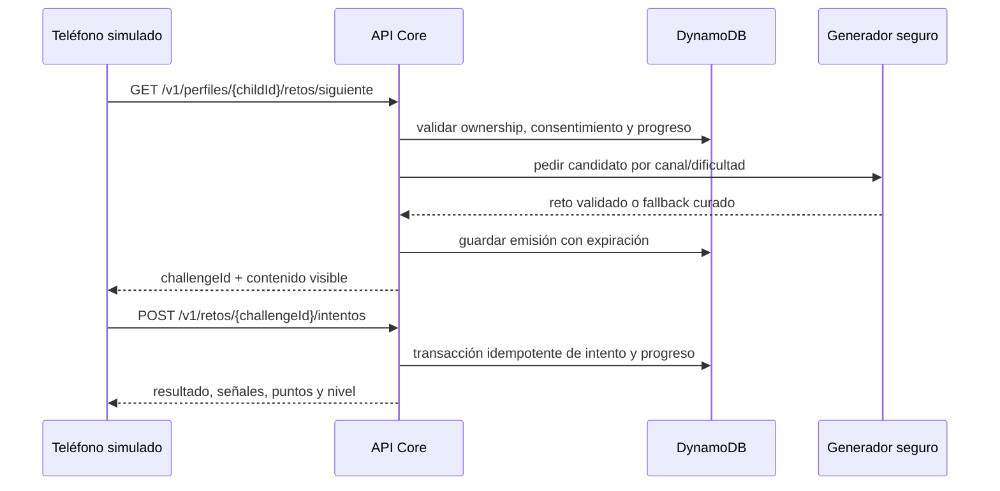

# Arquitectura — Ponte Trucha Kids

Esta guía describe la **arquitectura objetivo**. No implica que el backend ya
esté implementado. El estado y el orden de construcción viven en
`.kiro/specs/*/tasks.md`.

## Decisiones vigentes

- Hosting estático privado en S3, expuesto únicamente por CloudFront con OAC.
- La única cuenta autenticada pertenece al padre, madre o tutor en Cognito.
- Cada adulto puede crear perfiles infantiles sin correo, contraseña ni nombre
  real.
- API Gateway HTTP API valida access tokens de Cognito mediante JWT authorizer.
- El backend es serverless en Python 3.14, con FastAPI y AWS Lambda Web Adapter.
- DynamoDB guarda consentimiento, perfiles, progreso, intentos e idempotencia.
- No se usa EC2, RDS, NAT Gateway, OpenSearch, ElastiCache ni Kubernetes en el
  MVP.
- Terraform es la fuente de verdad de infraestructura.
- El LLM on-device sigue siendo el plan A. Amazon Bedrock es el fallback
  server-side y debe operar con retención cero; nunca se envía identidad.
- CloudWatch y Powertools son la fuente operativa. Sentry reporta errores
  sanitizados. Mixpanel recibe solo eventos permitidos y consentidos.

## Diagrama principal

El diagrama con iconos oficiales de AWS está en
[`docs/diagramas/arquitectura-backend.svg`](../../docs/diagramas/arquitectura-backend.svg).



## Límites de módulos

El backend empieza como **monolito modular**, no como microservicios. Puede
desplegarse en dos Lambdas para aislar tiempos y permisos:

1. `api-core`: consentimiento, perfiles, retos, intentos y progreso.
2. `api-ia`: generación/adaptación con IA y guardrails.

Una tercera Lambda de analítica solo se agrega si la spec de observabilidad lo
justifica. La caída de Mixpanel o Sentry nunca puede bloquear el juego.

```text
infra/
├── modules/                  # módulos Terraform pequeños y reutilizables
├── environments/
│   ├── dev/
│   └── prod/
└── tests/                    # terraform test; mocks antes de recursos reales

backend/
├── src/ponte_trucha/
│   ├── domain/               # entidades, value objects, reglas puras
│   ├── application/          # casos de uso y puertos
│   ├── adapters/             # DynamoDB, Bedrock, Mixpanel, Sentry
│   └── entrypoints/http/     # FastAPI, DTO y composición
└── tests/
    ├── unit/
    ├── contract/
    └── integration/
```

La estructura anterior es objetivo; crearla requiere tareas aprobadas. No mover
el frontend existente al planificar el backend.

## Regla de dependencias

```text
entrypoints ──> application ──> domain
adapters    ──> application ──> domain
domain      ──> nada externo
```

- `domain` no importa FastAPI, boto3, Pydantic, Mixpanel ni Sentry.
- `application` declara puertos con `Protocol` y coordina casos de uso.
- `adapters` implementa puertos e infraestructura.
- `entrypoints` valida HTTP y transforma DTO; no contiene reglas del juego.
- La composición/DI es el único lugar que elige implementaciones concretas.
- Frontend y backend comparten contratos por OpenAPI, no importando código entre
  TypeScript y Python.

## Componentes y responsabilidades

| Componente | Responsabilidad | Datos permitidos |
|---|---|---|
| Cognito | Registro, verificación e inicio de sesión del adulto | Correo del adulto, `sub`, estado de verificación |
| API Gateway | TLS, JWT, CORS, límites y routing | Claims mínimos del token |
| API Core | Autorizar ownership y ejecutar casos de uso | IDs opacos, consentimientos, progreso |
| DynamoDB | Persistencia operacional | Datos mínimos con TTL cuando aplique |
| API IA | Selección/generación y guardrails | Banda etaria, dificultad, canal y texto desidentificado |
| Bedrock | Fallback de IA | Prompt sin identidad y con retención cero |
| CloudWatch | Salud, métricas, alarmas y logs | Códigos y metadatos técnicos; nunca cuerpos |
| Sentry | Diagnóstico de excepciones | Stack, release, ruta y código; nunca usuario/cuerpo/token |
| Mixpanel | Métricas de producto consentidas | Eventos y propiedades de lista permitida |

## Modelo de datos lógico

Se prefiere DynamoDB porque los accesos son conocidos, el volumen es pequeño y
no hay consultas relacionales complejas. No se adopta single-table avanzado sin
pruebas de los access patterns.

| Agregado | Clave conceptual | Accesos principales |
|---|---|---|
| Cuenta adulta | `PARENT#{cognitoSub}` | verificar configuración y ownership |
| Consentimiento | `PARENT#{sub}` + `CONSENT#{purpose}` | estado vigente, versión, revocación |
| Perfil infantil | `PARENT#{sub}` + `CHILD#{childId}` | listar, leer, borrar |
| Progreso | `CHILD#{childId}` + `PROGRESS#{app}` | siguiente nivel y resumen |
| Reto emitido | `CHILD#{childId}` + `CHALLENGE#{id}` | responder una vez, expirar |
| Intento | `CHILD#{childId}` + `ATTEMPT#{id}` | historial mínimo y cálculo |
| Idempotencia | `IDEMPOTENCY#{key}` | evitar doble puntuación; TTL |

El backend siempre deriva el adulto desde el access token y comprueba que el
perfil infantil le pertenece. Nunca confía en un `parentId` enviado por el
cliente.

## Flujo del reto



La respuesta correcta y las reglas de puntuación no se envían en el GET. El
cliente recibe el resultado únicamente después del intento.

## Patrones aprobados

| Feature | Patrón | Motivo |
|---|---|---|
| Apps/canales y escenarios | Abstract Factory + Strategy | Construir y validar SMS, email, WhatsApp y Roblox sin condicionales dispersos |
| Adaptación de dificultad | Strategy + Specification | Elegir dificultad y candidatos elegibles por banda, nivel y repetición |
| Casos de uso | Application Service / Command-Query Separation ligera | Separar lectura de retos de mutaciones de intento/consentimiento |
| Persistencia | Repository | Aislar DynamoDB del dominio y facilitar TDD |
| Proveedores IA | Ports and Adapters | Sustituir on-device, Bedrock o fallback curado |
| Guardrails | Chain of Responsibility | Ejecutar validaciones pequeñas, ordenadas y testeables |
| Analítica | Domain Events + Observer/Adapter | Desacoplar Mixpanel del camino crítico |
| Reintentos | Idempotency + Retry con backoff | Evitar puntos dobles y controlar fallos transitorios |
| Ciclos de vida | Máquina de estados explícita | Controlar reto emitido/respondido/expirado y escenario borrador/publicado/retirado |

No usar un patrón por estética. `State` como clases, Unit of Work, bus de
comandos o saga se agregan solo si una tarea demuestra la necesidad.

## Integración con frontend

- Base path versionado: `/v1`.
- JSON en `camelCase`; fechas UTC en RFC 3339; IDs opacos.
- Errores `application/problem+json` según RFC 9457.
- Mutaciones sensibles usan `Idempotency-Key`.
- El access token viaja en `Authorization: Bearer`, nunca en URL ni
  `localStorage`. La estrategia exacta de sesión frontend se define en su spec.
- OpenAPI 3.1 generado por FastAPI es el contrato fuente.

## Decisiones de costo

- DynamoDB **provisioned** al inicio para usar su free tier mensual. La suma de
  tablas/ambientes debe permanecer por debajo de 25 RCU y 25 WCU por
  región/cuenta pagadora. On-demand requiere una decisión de costo explícita.
- Evaluar el plan CloudFront Free de $0 vigente para una distribución; no
  asumir automáticamente el modelo histórico pay-as-you-go.
- Cero VPC/NAT para Lambdas en el MVP.
- ARM64 cuando todas las dependencias lo soporten.
- Sin provisioned concurrency salvo medición que justifique el gasto.
- Presupuestos y alarmas son obligatorios, aunque los reportes de costo tengan
  retraso.
- Toda feature externa debe tener flag de apagado y límite de gasto.

Los límites y fecha de verificación están en
`.kiro/docs/costos-aws.md`.

## Reglas de cambio

- Cambiar un endpoint exige primero actualizar OpenAPI/spec y pruebas de
  contrato.
- Cambiar un access pattern exige actualizar esta guía y el diseño de backend.
- Agregar un servicio AWS exige explicar costo, IAM, retención y estrategia de
  borrado.
- Tocar `src/types/`, `src/store/` o `src/App.tsx` requiere avisar al equipo.
- Tocar `src/data/` o `src/game/` se coordina con Clau; tocar UI con Jerick.
