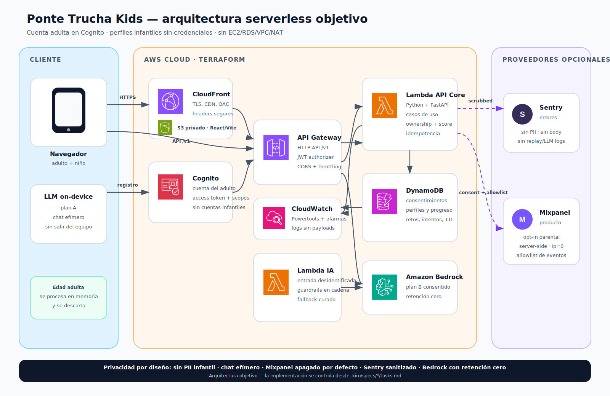

<div align="center">

# 🐟 Ponte Trucha Kids

**El juego que enseña a niños de 8 a 13 años a detectar trampas digitales**

Hackathon Kiro + AWS · Código Facilito

</div>

## Qué es

Ponte Trucha Kids simula un teléfono: llega una notificación de Roblox, SMS,
email o WhatsApp; el niño abre la app y decide si el contenido es una trampa o
es confiable. Después recibe feedback sobre las señales, suma puntos y progresa
en dificultad.

La cuenta pertenece al padre, madre o tutor. El adulto completa el registro y
los consentimientos; el niño usa un perfil sin correo, contraseña, nombre real
ni fecha de nacimiento.

## Estado del proyecto

| Área | Estado |
|---|---|
| Teléfono simulado y loop local | existe un demo frontend |
| Banco curado y LLM on-device/fallback legado | existe una primera versión |
| Cognito adulto y consentimiento | especificado; pendiente de Kiro |
| API Python, DynamoDB y progreso remoto | especificado; pendiente de Kiro |
| Terraform del backend | especificado; pendiente de Kiro |
| CloudWatch, Sentry y Mixpanel | especificado; pendiente de Kiro |

La documentación describe explícitamente la **arquitectura objetivo**. No se
debe presentar una pieza pendiente como implementada.

## Arquitectura objetivo

[](docs/diagramas/arquitectura-backend.svg)

- React/Vite en S3 privado + CloudFront.
- Cognito para la cuenta adulta.
- API Gateway HTTP API con JWT authorizer.
- Lambdas Python 3.14 + FastAPI + AWS Lambda Web Adapter.
- DynamoDB; no RDS.
- Sin EC2, VPC ni NAT Gateway en el MVP.
- LLM on-device como plan A y Bedrock con retención cero como fallback.
- CloudWatch/Powertools, Sentry sin PII y Mixpanel opt-in server-side.
- Infraestructura como código con Terraform.

Detalle: [arquitectura](.kiro/steering/arquitectura.md) ·
[PRD de backend](.kiro/docs/prd-backend-serverless.md) ·
[observabilidad](.kiro/docs/observabilidad-y-privacidad.md) ·
[setup local/Kiro](.kiro/docs/setup-backend.md) ·
[costos/free tier](.kiro/docs/costos-aws.md).

## Privacidad infantil

- Cognito representa solo al adulto.
- La fecha del adulto se usa como age gate y se descarta; no prueba por sí sola
  consentimiento parental verificable.
- El perfil infantil conserva solo alias/avatar de catálogo y banda etaria.
- IA y analítica tienen decisiones separadas.
- Mixpanel está apagado por defecto, sin IP/geolocalización ni texto libre.
- Sentry elimina request, user, tokens, cuerpos y PII antes del envío.
- El chat del niño es efímero y no se persiste.
- El adulto puede revocar finalidades y borrar cuenta/perfiles.

Antes de producción se requiere revisión legal del mecanismo de consentimiento.
Ver [seguridad infantil](.kiro/steering/seguridad-infantil.md).

## Desarrollo con Kiro

```text
requirements.md → design.md/ADR → tasks.md → test rojo
                → implementación → refactor → verificación
```

### Specs activas de backend

| Spec | Alcance | Owner |
|---|---|---|
| [autenticación y consentimiento](.kiro/specs/autenticacion-consentimiento-parental/) | adulto, Cognito, finalidades, perfiles y borrado | Francis |
| [backend serverless](.kiro/specs/backend-serverless/) | API, DynamoDB, apps, score, adaptación, IA y Terraform | Francis |
| [observabilidad privada](.kiro/specs/observabilidad-privada/) | CloudWatch, Sentry, Mixpanel, alarmas y privacidad | Francis |

Las specs del demo anterior conservan historial y tienen avisos de migración.

### Patrones

| Feature | Patrón |
|---|---|
| Apps/escenarios | Abstract Factory + Strategy |
| Adaptación | Strategy + Specification |
| Persistencia | Repository |
| IA/proveedores | Ports and Adapters |
| Guardrails | Chain of Responsibility |
| Analítica | Domain Events + Adapter |
| Intentos | Idempotency + transacción condicional |
| Ciclos | Máquina de estados explícita |

La arquitectura es hexagonal y aplica SOLID. No se agregan patrones que no
resuelvan una necesidad demostrada.

## API

OpenAPI 3.1 será el contrato fuente. FastAPI ofrece Swagger UI/ReDoc en local;
la recomendación para referencia interna es Scalar sobre el mismo
`openapi.json`. Los errores usan RFC 9457.

Ver [estrategia de documentación API](.kiro/docs/documentacion-api.md).

## Plan

El orden completo está en [plan Kiro](.kiro/docs/plan-7-dias.md):

1. ADR, threat model, access patterns y OpenAPI.
2. Setup Python/Terraform con TDD.
3. Cognito, consentimiento y perfiles.
4. Retos, intentos, progreso y adaptación.
5. Infraestructura `dev`.
6. Observabilidad y revisión de privacidad.
7. Integración, seguridad y lanzamiento.

## Proyecto actual

```bash
npm install
cp .env.example .env.local
npm run dev
```

| Comando | Uso |
|---|---|
| `npm run lint` | lint frontend |
| `npm run test` | tests frontend |
| `npm run validar:escenarios` | valida banco curado |
| `npm run build` | build estático |

Los comandos Python y Terraform se agregarán únicamente al ejecutar las tareas
de setup; hoy no se afirma que estén disponibles.

## Equipo

- **Jerick:** frontend y experiencia.
- **Francis:** backend, IA e infraestructura AWS.
- **Clau:** producto, contenido y reglas del juego.

`src/types/`, `src/store/` y `src/App.tsx` son compartidos. Toda integración de
backend debe avisar antes a Jerick; cambios de escenarios/score se coordinan con
Clau.

## Skills de Kiro

`.kiro/skills/` contiene skills del proyecto y las guías auditadas para:

- backend AWS serverless de Ponte Trucha;
- estilo y pruebas de Terraform;
- auditoría de seguridad no intrusiva;
- escenarios, pantallas y despliegue legado.

Las copias se mantienen sincronizadas con `.agents/skills/`. La procedencia y el
commit de cada skill externa están documentados dentro de su carpeta.
