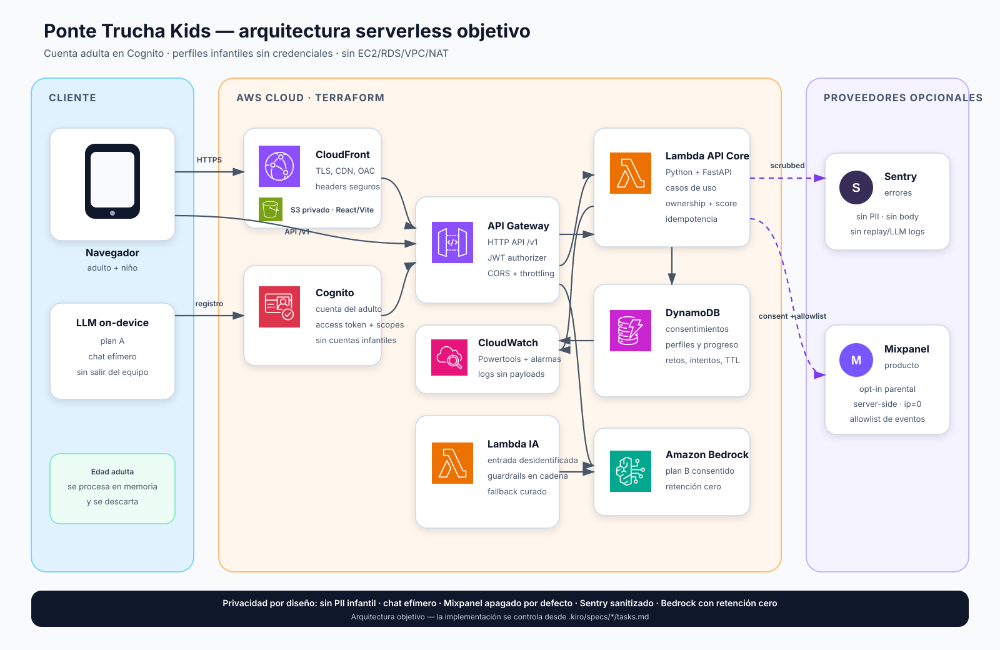

<div align="center">

# 🐟 Ponte Trucha Kids

**El juego que enseña a niños de 8 a 13 años a detectar estafas digitales, practicando en un teléfono simulado antes de encontrarlas en serio.**

[**🎮 Demo en vivo**](https://ponte-trucha.vercel.app) · [Arquitectura](#arquitectura) · [Privacidad](#privacidad-infantil) · [Equipo](#equipo)


</div>

## Qué es

A los niños ya les llegan estafas: Robux gratis, "mamá, se me malogró el cel",
cuentas "suspendidas". **Ponte Trucha Kids** simula un teléfono completo — con
WhatsApp, Mensajes, Discord, Roblox y Gmail — donde llegan esos mensajes de
verdad, escritos como los reales. El niño decide si son **trampa o confianza**,
puede conversar con el estafador para ver hasta dónde llega, y recibe feedback
inmediato: la pista exacta que se le pasó y la regla que le sirve para la
próxima. Sin regaños, sumando puntos y racha.

La cuenta pertenece al padre, madre o tutor: el adulto pasa un age gate, se
registra y decide cada permiso por separado. El niño juega con un perfil sin
correo, sin contraseña, sin nombre real y sin fecha de nacimiento.

## Pruébalo

1. Entra a [ponte-trucha.vercel.app](https://ponte-trucha.vercel.app).
2. Crea la cuenta de adulto (age gate → registro con AWS Cognito → permisos).
3. Crea el perfil del niño (alias de catálogo + avatar + banda de edad) y juega.

## Estado del proyecto

| Área | Estado |
|---|---|
| Teléfono simulado y loop de juego | ✅ funcionando contra el backend real |
| Backend serverless (API, DynamoDB, progreso) | ✅ **desplegado en AWS** (us-east-1) |
| Cognito adulto, consentimiento y perfiles | ✅ flujo completo verificado extremo a extremo en producción |
| Banco curado de escenarios | ✅ lo sirve el backend; el JSON versionado es la fuente de contenido |
| Terraform del backend | ✅ aplicado en AWS real y reproducible en el emulador local |
| Frontend en producción | ✅ Vercel (con rewrites hacia API Gateway); S3 + CloudFront es el objetivo final |
| Bedrock / IA server-side | 🔒 implementado tras bandera, **apagado por defecto** (ADR-006: Nova Lite con retención cero); hoy responde el guion curado |
| CloudWatch, Sentry y Mixpanel | 🚧 especificado; alarmas de throttling y presupuesto activos |

La documentación distingue siempre la **arquitectura objetivo** de lo
implementado; nada pendiente se presenta como terminado. Para levantarlo sin
cuenta de AWS: [probar en local](.kiro/docs/probar-en-local.md).

## Arquitectura

[](docs/diagramas/arquitectura-backend.svg)

- **Frontend:** React + Vite + Tailwind; el teléfono, sus 5 apps y el juego son
  componentes puros sin framework de UI adicional.
- **Identidad:** Cognito User Pool solo para el adulto, con Hosted UI
  (Authorization Code + PKCE) y scopes de resource server por permiso.
- **API:** API Gateway HTTP API con JWT authorizer y throttling; errores RFC 9457.
- **Cómputo:** 2 Lambdas Python 3.14 (arm64) + FastAPI, concurrencia reservada.
- **Datos:** DynamoDB provisionado dentro del free tier; TTL y cifrado. Sin RDS,
  EC2, VPC ni NAT Gateway.
- **IA:** estafador conversacional con guion curado y guardrails; Bedrock
  (retención cero) como fallback explícitamente opt-in.
- **IaC:** todo en Terraform (módulos `data`, `identity`, `api`), probado con
  `terraform test` y contra el emulador local antes de tocar AWS.

Detalle: [arquitectura](.kiro/steering/arquitectura.md) ·
[PRD de backend](.kiro/docs/prd-backend-serverless.md) ·
[observabilidad](.kiro/docs/observabilidad-y-privacidad.md) ·
[costos/free tier](.kiro/docs/costos-aws.md).

## Privacidad infantil

Es un producto para menores: los límites no son negociables.

- Cognito representa **solo al adulto**; el perfil infantil guarda únicamente
  alias de catálogo, avatar y banda etaria.
- La fecha de nacimiento del adulto se evalúa en el navegador y se descarta:
  solo queda la versión de la regla y la hora de aprobación.
- Cada permiso (cuenta, IA en la nube, analítica) es una decisión separada,
  versionada y revocable. Lo opcional viene **apagado por defecto**.
- El chat del niño es efímero: no se persiste ni se registra en logs.
- Sentry se sanitiza (sin request, user, tokens ni cuerpos) y Mixpanel es
  opt-in server-side, sin IP ni texto libre.
- El adulto puede revocar finalidades y borrar cuenta y perfiles por completo.

Antes de producción se requiere revisión legal del mecanismo de consentimiento.
Ver [seguridad infantil](.kiro/steering/seguridad-infantil.md).

## Desarrollo con Kiro (spec-driven)

```text
requirements.md → design.md/ADR → tasks.md → test rojo
                → implementación → refactor → verificación
```

Todo el proyecto se construyó con specs de Kiro como fuente de verdad:

| Spec | Alcance | Owner |
|---|---|---|
| [autenticación y consentimiento](.kiro/specs/autenticacion-consentimiento-parental/) | adulto, Cognito, finalidades, perfiles y borrado | Francis |
| [backend serverless](.kiro/specs/backend-serverless/) | API, DynamoDB, apps, score, adaptación, IA y Terraform | Francis |
| [observabilidad privada](.kiro/specs/observabilidad-privada/) | CloudWatch, Sentry, Mixpanel, alarmas y privacidad | Francis |
| [interfaz del teléfono](.kiro/specs/interfaz-telefono/) | carcasa, apps simuladas y experiencia de juego | Jerick |
| [banco de escenarios](.kiro/specs/banco-escenarios/) | contenido, tono infantil y reglas de juego | Clau |

La arquitectura es hexagonal (Ports and Adapters) y aplica SOLID; los patrones
usados (Repository, Strategy, Chain of Responsibility para guardrails,
idempotencia con transacciones condicionales) resuelven necesidades
demostradas, no decoración.

## Correr el proyecto

```bash
npm install
cp .env.example .env.local   # llena los valores o genera con npm run entorno:floci
npm run dev
```

| Comando | Uso |
|---|---|
| `npm run lint` | lint del frontend |
| `npm run test` | tests del frontend (Vitest) |
| `npm run validar:escenarios` | valida el banco curado de contenido |
| `npm run build` | build estático de producción |
| `npm run entorno:floci` | genera `.env.local` desde los outputs de Terraform |
| `npm run probar:floci` | recorre el API emulado con login real de Cognito |
| `npm run probar:local` | recorre el API en memoria, sin emulador |

El juego necesita backend a propósito: sin `.env.local` no hay partida. El
recorrido completo (incluido el backend Python y el emulador Floci) está en
[probar en local](.kiro/docs/probar-en-local.md).

## Equipo — KikiriKillers 🐔

| | Rol |
|---|---|
| **Jerick** | Frontend, experiencia de juego y despliegue |
| **Francis** | Backend, IA e infraestructura AWS |
| **Clau** | Producto, contenido y reglas del juego |

`src/types/`, `src/store/` y `src/App.tsx` son compartidos: toda integración se
coordina antes de tocarlos.

## Licencia

Este proyecto se publica bajo la licencia [MIT](LICENSE).
