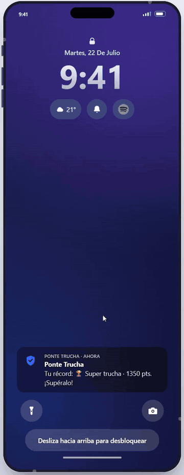
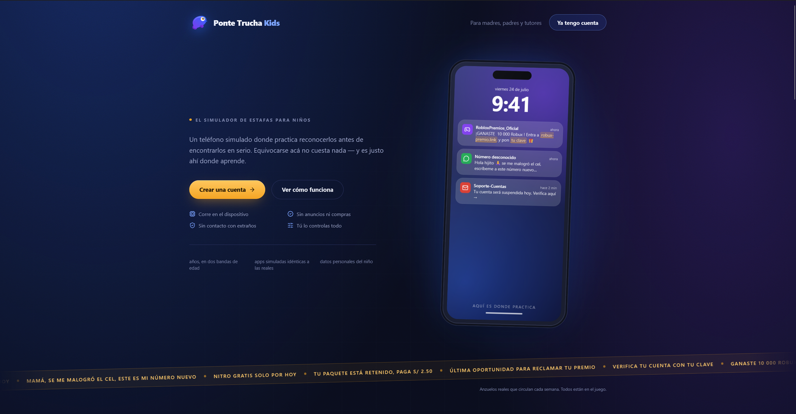
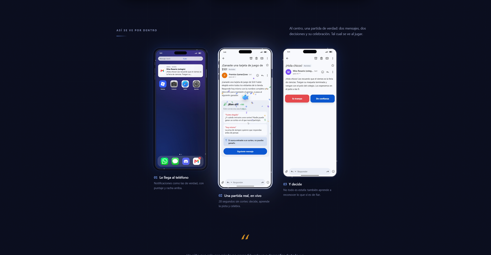
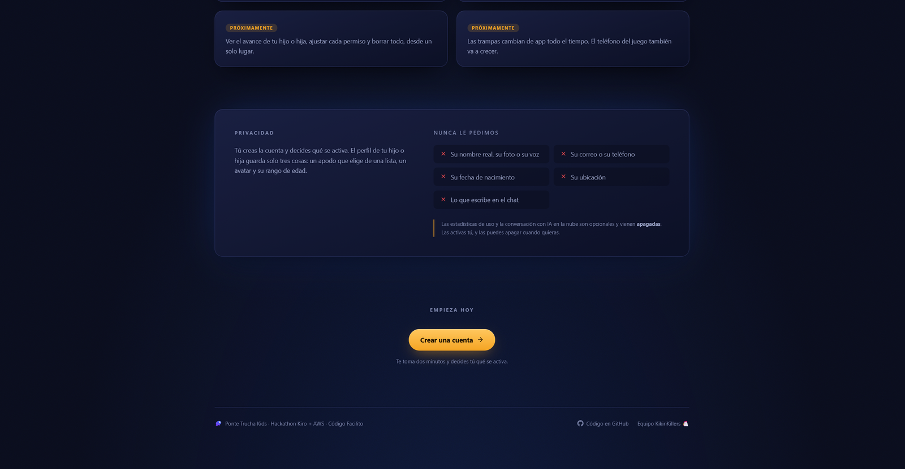

<div align="center">

# 🐟 Ponte Trucha Kids

**El juego que enseña a niños de 8 a 13 años a detectar estafas digitales, practicando en un teléfono simulado antes de encontrarlas en serio.**

[**🎮 Demo en vivo**](https://ponte-trucha.vercel.app) · [**🎥 Video de presentación**](https://www.youtube.com/shorts/5fAVoFoSqfo) · [Arquitectura](#arquitectura) · [Decisiones (ADRs)](#decisiones-de-arquitectura) · [Privacidad](#privacidad-infantil) · [Hoja de ruta](#hoja-de-ruta) · [Equipo](#equipo--kikirikillers-)


</div>

## Qué es

A los niños ya les llegan estafas: Robux gratis, "mamá, se me malogró el cel",
cuentas "suspendidas". **Ponte Trucha Kids** simula un teléfono completo — con
WhatsApp, Mensajes, Discord, Roblox y Gmail — donde llegan esos mensajes de
verdad, escritos como los reales. El niño decide si son **trampa o confianza**,
puede conversar con el estafador para ver hasta dónde llega, y recibe feedback
inmediato: la pista exacta que se le pasó y la regla que le sirve para la
próxima. Sin regaños, sumando puntos y racha.

La cuenta pertenece al padre, madre o tutor: el adulto pasa un age gate, se
registra y decide cada permiso por separado. El niño juega con un perfil sin
correo, sin contraseña, sin nombre real y sin fecha de nacimiento.

## El proyecto en números

| 5 | 11 | 6 | 145 | 6 | 5 |
|:---:|:---:|:---:|:---:|:---:|:---:|
| apps simuladas | escenarios curados | tipos de estafa | tests automatizados | ADRs registrados | specs de Kiro |

## Cómo se diferencia

| Característica | Cómo funciona |
|---|---|
| **Teléfono simulado completo** | WhatsApp, Mensajes, Discord, Roblox y Gmail recreados; la estafa llega por el canal donde llegaría de verdad. |
| **Estafador conversacional** | El niño puede seguirle la conversación para ver cómo presiona; responde un guion curado con guardrails (IA en la nube solo con permiso explícito). |
| **Feedback que enseña** | Cada escenario declara sus señales de alerta y la lección; al fallar, el juego muestra la pista exacta que se le pasó, sin regaños. |
| **Progresión** | Puntos, racha, medallas y nivel de "trucha" que sube con la práctica. |
| **Privacidad infantil** | La cuenta es del adulto; el perfil del niño no guarda correo, nombre real ni fecha de nacimiento. |

## Así se ve

<p align="center">
  
  &nbsp;&nbsp;
</p>

**La demo en movimiento.** El teléfono simulado recibe los anzuelos como
llegarían de verdad; el juego celebra el récord y reta a superarlo.



**El anzuelo, tal cual llega.** Robux gratis, el "mamá, se me malogró el cel" y
la cuenta "suspendida": los tres en la pantalla de inicio, como en un teléfono
real.



**Una partida real, en vivo.** Llega la notificación, el niño abre el mensaje,
decide entre **Es trampa** o **De confianza**, y el feedback le señala la pista
concreta ("fuiste elegido", "hoy mismo") con la regla para la próxima.

## Pruébalo

🎥 **[Mira el video de presentación](https://www.youtube.com/shorts/5fAVoFoSqfo)** o juégalo tú mismo:

1. Entra a [ponte-trucha.vercel.app](https://ponte-trucha.vercel.app).
2. Crea la cuenta de adulto (age gate → registro con AWS Cognito → permisos).
3. Crea el perfil del niño (alias de catálogo + avatar + banda de edad) y juega.

## Estado del proyecto

| Área | Estado |
|---|---|
| Teléfono simulado y loop de juego | ✅ funcionando contra el backend real |
| Backend serverless (API, DynamoDB, progreso) | ✅ **desplegado en AWS** (us-east-1) |
| Cognito adulto, consentimiento y perfiles | ✅ flujo completo verificado extremo a extremo en producción |
| Banco curado de escenarios | ✅ lo sirve el backend; el JSON versionado es la fuente de contenido |
| Terraform del backend | ✅ aplicado en AWS real y reproducible en el emulador local |
| Frontend en producción | ✅ Vercel (con rewrites hacia API Gateway); S3 + CloudFront es el objetivo final |
| Bedrock / IA server-side | 🔒 implementado tras bandera, **apagado por defecto** (ADR-006: Nova Lite con retención cero); hoy responde el guion curado |
| CloudWatch, Sentry y Mixpanel | 🚧 especificado; alarmas de throttling y presupuesto activos |

La documentación distingue siempre la **arquitectura objetivo** de lo
implementado; nada pendiente se presenta como terminado. Para levantarlo sin
cuenta de AWS: [probar en local](.kiro/docs/probar-en-local.md).

## Arquitectura

[](docs/diagramas/arquitectura-backend.svg)

- **Frontend:** React + Vite + Tailwind; el teléfono, sus 5 apps y el juego son
  componentes puros sin framework de UI adicional.
- **Identidad:** Cognito User Pool solo para el adulto, con Hosted UI
  (Authorization Code + PKCE) y scopes de resource server por permiso.
- **API:** API Gateway HTTP API con JWT authorizer y throttling; errores RFC 9457.
- **Cómputo:** 2 Lambdas Python 3.14 (arm64) + FastAPI, concurrencia reservada.
- **Datos:** DynamoDB provisionado dentro del free tier; TTL y cifrado. Sin RDS,
  EC2, VPC ni NAT Gateway.
- **IA:** estafador conversacional con guion curado y guardrails; Bedrock
  (retención cero) como fallback explícitamente opt-in.
- **IaC:** todo en Terraform (módulos `data`, `identity`, `api`), probado con
  `terraform test` y contra el emulador local antes de tocar AWS.

Detalle: [arquitectura](.kiro/steering/arquitectura.md) ·
[PRD de backend](.kiro/docs/prd-backend-serverless.md) ·
[observabilidad](.kiro/docs/observabilidad-y-privacidad.md) ·
[costos/free tier](.kiro/docs/costos-aws.md).

### Modelo de datos

DynamoDB con capacidad provisionada dentro del free tier, TTL y cifrado. El
modelo físico (particiones, claves e índices) está documentado en
[el diagrama](docs/diagramas/modelo-fisico-dynamodb.mmd) y justificado en el
[ADR-003](.kiro/specs/backend-serverless/adr/ADR-003-modelo-fisico-dynamodb.md).

## Decisiones de arquitectura

Cada decisión relevante quedó registrada como ADR, con su contexto y las
consecuencias que se aceptaron a conciencia:

| ADR | Decisión |
|---|---|
| [ADR-001](.kiro/specs/backend-serverless/adr/ADR-001-lambda-web-adapter-y-empaquetado.md) | Lambda Web Adapter y estrategia de empaquetado |
| [ADR-002](.kiro/specs/backend-serverless/adr/ADR-002-sesion-cognito-spa.md) | Sesión de Cognito en una SPA (Authorization Code + PKCE) |
| [ADR-003](.kiro/specs/backend-serverless/adr/ADR-003-modelo-fisico-dynamodb.md) | Modelo físico de DynamoDB |
| [ADR-004](.kiro/specs/backend-serverless/adr/ADR-004-analitica-desacoplada.md) | Analítica desacoplada del flujo de juego |
| [ADR-005](.kiro/specs/backend-serverless/adr/ADR-005-bedrock-deshabilitado-hasta-retencion-cero.md) | Bedrock deshabilitado hasta garantizar retención cero |
| [ADR-006](.kiro/specs/backend-serverless/adr/ADR-006-bedrock-nova-lite-con-retencion-cero.md) | Nova Lite con retención cero como modelo elegido |

## Costos: guardrails antes que facturas

El backend corre en la cuenta del hackathon con una regla dura: **un error de
configuración debe degradar el servicio antes de generar un cobro**. En la
práctica:

- DynamoDB con capacidad **provisionada fija** bajo el allowance permanente
  (25 RCU / 25 WCU sumando tablas): excederla produce throttling, no factura.
- Lambda con concurrencia reservada baja y timeout corto; API Gateway con
  throttling por stage.
- Bedrock apagado por bandera, con kill switch, cuota y fallback al guion
  curado: nunca se asume gratis.
- Logs sin payloads, con retención corta explícita.
- Presupuesto y alarmas de costo activos desde el setup.

El detalle, con fuentes y allowances verificados, está en
[costos-aws.md](.kiro/docs/costos-aws.md).

## Privacidad infantil



Es un producto para menores: los límites no son negociables.

- Cognito representa **solo al adulto**; el perfil infantil guarda únicamente
  alias de catálogo, avatar y banda etaria.
- La fecha de nacimiento del adulto se evalúa en el navegador y se descarta:
  solo queda la versión de la regla y la hora de aprobación.
- Cada permiso (cuenta, IA en la nube, analítica) es una decisión separada,
  versionada y revocable. Lo opcional viene **apagado por defecto**.
- El chat del niño es efímero: no se persiste ni se registra en logs.
- Sentry se sanitiza (sin request, user, tokens ni cuerpos) y Mixpanel es
  opt-in server-side, sin IP ni texto libre.
- El adulto puede revocar finalidades y borrar cuenta y perfiles por completo.

Antes de producción se requiere revisión legal del mecanismo de consentimiento.
Ver [seguridad infantil](.kiro/steering/seguridad-infantil.md).

## Desarrollo con Kiro (spec-driven)

```text
requirements.md → design.md/ADR → tasks.md → test rojo
                → implementación → refactor → verificación
```

Todo el proyecto se construyó con specs de Kiro como fuente de verdad:

| Spec | Alcance | Owner |
|---|---|---|
| [autenticación y consentimiento](.kiro/specs/autenticacion-consentimiento-parental/) | adulto, Cognito, finalidades, perfiles y borrado | Francis |
| [backend serverless](.kiro/specs/backend-serverless/) | API, DynamoDB, apps, score, adaptación, IA y Terraform | Francis |
| [observabilidad privada](.kiro/specs/observabilidad-privada/) | CloudWatch, Sentry, Mixpanel, alarmas y privacidad | Francis |
| [interfaz del teléfono](.kiro/specs/interfaz-telefono/) | carcasa, apps simuladas y experiencia de juego | Jerick |
| [banco de escenarios](.kiro/specs/banco-escenarios/) | contenido, tono infantil y reglas de juego | Clau |

La arquitectura es hexagonal (Ports and Adapters) y aplica SOLID; los patrones
usados (Repository, Strategy, Chain of Responsibility para guardrails,
idempotencia con transacciones condicionales) resuelven necesidades
demostradas, no decoración.

## Verificación automatizada

- **145 tests en 13 archivos** (Vitest) cubren la lógica pura: motor de juego,
  medallas, nivel, guardrails del estafador y cliente del LLM.
- **Validador propio del banco de contenido** (`npm run validar:escenarios`):
  el compilador no puede validar un JSON de escenarios, así que un script lo
  contrasta contra su esquema — campos obligatorios, enums de tipo, canal y
  dificultad, ids únicos y señales bien formadas — antes de cada cambio.
- ESLint y build de producción completan la verificación; nada se da por
  terminado sin ejecutarla (así lo exige el propio `CLAUDE.md` del repo).

## Correr el proyecto

```bash
npm install
cp .env.example .env.local   # llena los valores o genera con npm run entorno:floci
npm run dev
```

| Comando | Uso |
|---|---|
| `npm run lint` | lint del frontend |
| `npm run test` | tests del frontend (Vitest) |
| `npm run validar:escenarios` | valida el banco curado de contenido |
| `npm run build` | build estático de producción |
| `npm run entorno:floci` | genera `.env.local` desde los outputs de Terraform |
| `npm run probar:floci` | recorre el API emulado con login real de Cognito |
| `npm run probar:local` | recorre el API en memoria, sin emulador |

El juego necesita backend a propósito: sin `.env.local` no hay partida. El
recorrido completo (incluido el backend Python y el emulador Floci) está en
[probar en local](.kiro/docs/probar-en-local.md).

## Hoja de ruta

La versión presentada es una demo funcional completa de punta a punta, acotada
en alcance y diseñada para crecer sin rehacerse:

- **Hosting final en S3 + CloudFront** (hoy Vercel con rewrites hacia API
  Gateway).
- **Activar Bedrock Nova Lite** tras verificar retención cero en producción
  (ADR-006); mientras tanto responde el guion curado.
- **Observabilidad completa**: CloudWatch, Sentry sanitizado y Mixpanel opt-in,
  ya especificados; hoy solo corren las alarmas de throttling y presupuesto.
- **Ampliar el banco de escenarios** con más tipos de estafa y más mensajes
  legítimos, manteniendo la validación automática.
- **Revisión legal del mecanismo de consentimiento** antes de cualquier salida
  a producción real.

El criterio para priorizar no cambia: ninguna mejora entra si compromete la
privacidad infantil o los guardrails de costo.

## Las preguntas del hackathon

### ¿Qué problema soluciona el proyecto?

**A los niños ya les están llegando estafas, y nadie les enseñó a reconocerlas.**

No hablamos de "cuando sean grandes": hoy, en el celular que usan para jugar
Roblox o hablar con sus amigos. Les llega el "Robux gratis, solo pon tu
usuario", el "mamá, se me malogró el cel" que en realidad le llega al niño
desde un número desconocido, el "tu cuenta fue suspendida, haz clic hoy mismo".
Son mensajes diseñados para funcionar con urgencia y con la emoción de recibir
algo gratis — y un niño de 10 años cae en eso mucho más rápido que un adulto.

Lo que existe hoy para enseñarles es un video o una charla del colegio: le
dices al niño "no hables con extraños en internet" y él asiente. Pero **saber
la regla no es lo mismo que reconocer la estafa cuando te llega**. Es como
aprender a manejar leyendo el manual.

Ponte Trucha Kids es el simulador donde puede equivocarse gratis. Le damos un
teléfono completo — WhatsApp, Mensajes, Discord, Roblox y Gmail — y ahí le
llegan los anzuelos escritos igual que los reales, por el canal por el que
llegarían de verdad. El niño decide si es **trampa o de confianza**, y si
quiere, le sigue la conversación al estafador para ver cómo presiona cuando le
dices que no.

Lo importante pasa después de responder: si falla, no le decimos "mal". Le
mostramos la pista exacta que se le pasó ("fuiste elegido", "hoy mismo", el
link raro) y la regla que le sirve para la próxima vez. Sin regaños, con puntos
y racha, porque un niño regañado deja de jugar y un niño que suma vuelve
mañana.

Y hay un segundo problema que tuvimos que resolver sí o sí: casi cualquier app
para niños termina pidiendo datos del niño. La nuestra no. Una herramienta que
enseña a cuidar tus datos no puede ser la primera en pedírtelos.

### ¿Por qué debería ganar? ¿Cuáles son sus mayores fortalezas?

No vamos a decir que somos los que mejor programan. Vamos a decir por qué esto
está terminado y funcionando, y no es una demo bonita con datos falsos.

1. **Está desplegado de verdad, de punta a punta.** Puedes entrar a la demo,
   pasar el age gate, crear tu cuenta con Cognito, aceptar permisos, crear el
   perfil del niño y jugar. Los escenarios los sirve el backend real en AWS, no
   un JSON dentro del frontend. El progreso se guarda en DynamoDB. Verificamos
   el flujo completo en producción, no en local.

2. **Usamos Kiro como se debe usar, no como autocompletado.** Todo salió de
   specs: requirements en formato EARS → design y ADRs → tasks → test rojo →
   implementación → verificación. 5 specs completas, 6 ADRs registrados y
   archivos de steering que gobiernan lo que el agente puede y no puede hacer.
   Cuando alguien pregunta "¿por qué Bedrock está apagado?" o "¿por qué
   DynamoDB provisionado?", hay un ADR con el contexto y las consecuencias que
   aceptamos a conciencia.

3. **La arquitectura AWS está pensada para no quemar la cuenta.** Serverless
   completo, todo en Terraform y probado contra un emulador local antes de
   tocar AWS real. Sin RDS, sin EC2, sin VPC, sin NAT Gateway. Y una regla
   dura: un error de configuración tiene que degradar el servicio antes de
   generar un cobro — si nos pasamos del free tier, hay throttling, no factura.

4. **La privacidad no es una sección del README, es una restricción de
   diseño.** La fecha de nacimiento del adulto se evalúa en el navegador y se
   descarta. Cada permiso es una decisión aparte, versionada y revocable, y lo
   opcional viene apagado por defecto. El chat del niño es efímero. Bedrock
   (Nova Lite con retención cero) está implementado pero apagado tras una
   bandera hasta verificar la retención en producción. Preferimos entregar
   menos IA que arriesgar datos de un menor.

5. **Verificamos lo que decimos.** 145 tests automatizados sobre la lógica
   pura, más un validador propio del banco de escenarios que revisa el
   contenido antes de cada cambio. Nada se da por terminado sin correr lint,
   tests y build.

6. **Somos honestos sobre lo que falta.** Este README distingue siempre lo
   implementado de la arquitectura objetivo: falta migrar el hosting a S3 +
   CloudFront, activar Bedrock, completar observabilidad y una revisión legal
   del consentimiento. No presentamos nada pendiente como terminado. Creemos
   que eso también cuenta.

En corto: resolvemos un problema que le pasa a niños reales hoy, lo entregamos
funcionando en AWS, lo construimos con el flujo que Kiro propone y no
comprometimos privacidad infantil ni control de costos para que se viera más
impresionante.

## Equipo — KikiriKillers 🐔

| | Rol |
|---|---|
| **Jerick** | Frontend, experiencia de juego y despliegue |
| **Francis** | Backend, IA e infraestructura AWS |
| **Clau** | Producto, contenido y reglas del juego |

`src/types/`, `src/store/` y `src/App.tsx` son compartidos: toda integración se
coordina antes de tocarlos.

## Licencia

Este proyecto se publica bajo la licencia [MIT](LICENSE).
